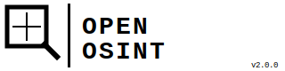

<div align="center">



**AI-powered Open Source Intelligence agent for security researchers, journalists, and investigators.**

[](LICENSE)
[](https://python.org)
[](https://anthropic.com)
[](https://github.com/openosint/openosint/actions)

> **GitHub social preview image**: [`assets/github-banner.svg`](assets/github-banner.svg)

</div>

> ⚠️ **Legal Disclaimer**: OpenOSINT is intended for **legal and authorized use only**.
> Users are solely responsible for ensuring their use complies with all applicable laws.
> The authors accept no liability for misuse. See [DISCLAIMER.md](DISCLAIMER.md).

OpenOSINT is a conversational CLI that uses Claude's native tool-use API to autonomously decide which OSINT tools to run, in what order, and how to chain findings — then compiles a structured intelligence report. You provide the target; the AI does the investigation.

---

## Table of Contents

- [Features](#features)
- [Quick Start](#quick-start)
- [OSINT Tools](#osint-tools)
- [CLI Reference](#cli-reference)
- [Providers](#providers)
- [Optional API Keys](#optional-api-keys)
- [Python API](#python-api)
- [Architecture](#architecture)
- [Configuration](#configuration)
- [Responsible Use](#responsible-use)
- [Legal & Ethics](DISCLAIMER.md)
- [Contributing](#contributing)
- [What's New](#whats-new)
- [License](#license)

---

## Features

- **Native Anthropic tool use** — no brittle prompt engineering; uses `stop_reason: tool_use` with real function dispatch
- **10 OSINT modules** covering email, username, domain, IP, phone, breach data, image metadata, and Google dorks
- **17-platform username search** (GitHub, Reddit, Twitter/X, Instagram, TikTok, YouTube, Twitch, and more)
- **Multi-provider** — Anthropic (default), OpenAI, or any Ollama local model
- **Beautiful terminal UI** powered by Rich — spinners, live tool output, styled reports
- **Interactive REPL + one-shot CLI** — chat with the agent or pipe it into scripts
- **Auto-saved Markdown reports** in a configurable `reports/` directory
- **Zero required API keys beyond Anthropic** — most tools work without any additional credentials

---

## Quick Start

### 1. Clone and install

```bash
git clone https://github.com/openosint/openosint
cd openosint
bash setup.sh
source .venv/bin/activate
```

### 2. Set your API key

```bash
export ANTHROPIC_API_KEY=sk-ant-...
# Or add to .env (copy from .env.example)
```

### 3. Investigate

```bash
# Interactive mode (recommended)
openosint

# One-shot investigation
openosint investigate john@example.com
openosint investigate example.com --save
openosint investigate 8.8.8.8
openosint investigate "+1 555 867 5309"
```

---

## OSINT Tools

| Tool | Target | Data Sources | Key Required |
|------|--------|-------------|--------------|
| `check_email` | Email | DNS/MX records, disposable DB, provider detection | None |
| `check_username` | Username | GitHub, Reddit, Twitter/X, Instagram, TikTok, YouTube, Twitch, +10 | None |
| `check_domain` | Domain | WHOIS, DNS (A/MX/NS/TXT), SSL cert, HTTP headers | None |
| `check_ip` | IP | ip-api.com geolocation, reverse DNS, AbuseIPDB (opt.) | Optional |
| `check_phone` | Phone | libphonenumber — country, carrier, line type | None |
| `check_breach` | Email | HaveIBeenPwned v3 — breaches + pastes | HIBP key |
| `check_metadata` | Image URL | EXIF — GPS, camera model, timestamps | None |
| `generate_dorks` | Any | Google/Bing dork generation (no API call) | None |
| `dns_lookup` | Domain | A, AAAA, MX, NS, TXT, CNAME, SOA, PTR | None |
| `whois_lookup` | Domain/IP | WHOIS — registrar, dates, nameservers | None |

---

## CLI Reference

### Interactive mode

```
$ openosint

  Target    john.doe@gmail.com

  › check_email  email john.doe@gmail.com
    ✓ valid=True  provider=Google  mx=gmail-smtp-in.l.google.com

  › check_breach  email john.doe@gmail.com
    ✓ breaches=2  latest=Adobe (2013)

  › check_username  username johndoe
    ✓ found on 5 platforms

  ...

openosint ❯ What about his domain example.com?
openosint ❯ save
openosint ❯ quit
```

**Interactive commands:**

| Command | Description |
|---------|-------------|
| `<target>` | Start an investigation |
| `investigate <target>` | Explicit investigation |
| `clear` | Reset conversation history |
| `save` | Save last report to file |
| `help` | Show help |
| `quit` / `exit` | Exit |

### One-shot mode

```bash
openosint investigate <target> [--save] [--output FILE] [--quiet]
```

```bash
# Examples
openosint investigate john@example.com
openosint investigate example.com --save
openosint investigate 198.51.100.1 --output /tmp/ip-report.md
openosint investigate "@johndoe" --quiet | grep "Account Discovery" -A 20
```

### Configuration

```bash
openosint config --show                          # show current config
openosint config --provider anthropic            # set provider
openosint config --model claude-opus-4-7         # set model
```

Settings are stored in `~/.config/openosint/config.json`. Environment variables always override saved settings.

---

## Providers

### Anthropic (default — best results)

```bash
export ANTHROPIC_API_KEY=sk-ant-...
# Default model: claude-sonnet-4-20250514
```

Uses Claude's native tool use API with `stop_reason: tool_use`. No prompt engineering needed — the model natively understands tool chaining and investigation strategy.

### OpenAI

```bash
export OPENAI_API_KEY=sk-...
export OPENOSINT_PROVIDER=openai
# Default model: gpt-4o
```

### Ollama (local / no API cost)

```bash
ollama pull llama3.1  # or qwen2.5, mistral, etc.
export OPENOSINT_PROVIDER=ollama
export OPENOSINT_MODEL=llama3.1
```

---

## Optional API Keys

These enhance investigation depth but are not required to start:

| Key | Service | How to get | What it unlocks |
|-----|---------|-----------|-----------------|
| `HIBP_API_KEY` | HaveIBeenPwned | [haveibeenpwned.com/API/Key](https://haveibeenpwned.com/API/Key) ($3.50/mo) | Breach + paste checking |
| `ABUSEIPDB_API_KEY` | AbuseIPDB | [abuseipdb.com/api](https://www.abuseipdb.com/api) (free tier) | IP reputation/abuse score |

Add to `.env` or export in your shell.

---

## Python API

```python
from openosint.config import Config
from openosint.display import Display
from openosint.agent import OpenOSINTAgent

config = Config.load()          # reads .env + env vars
display = Display(quiet=True)   # suppress banner/formatting
agent = OpenOSINTAgent(config, display)

report = agent.investigate("example.com")
print(report)

# Save to file
path = agent.save_report(report, "example.com")
```

Use individual tools directly:

```python
from openosint.tools.email_tools import check_email
from openosint.tools.domain_tools import check_domain
from openosint.tools.username_tools import check_username

result = check_email("user@example.com")
print(result["mx_records"])
print(result["username_variants"])

domain = check_domain("example.com")
print(domain["ssl"]["issuer"])
```

---

## Architecture

```
openosint/
├── cli.py          # Click CLI — interactive REPL + investigate command
├── agent.py        # AI agent loop — Anthropic/OpenAI tool-use dispatcher
├── config.py       # Configuration — env vars, ~/.config/openosint/config.json
├── display.py      # Rich terminal UI — banner, tool output, report rendering
└── tools/
    ├── registry.py      # Tool definitions (Anthropic format) + dispatcher
    ├── email_tools.py   # Email validation + DNS
    ├── username_tools.py # 17-platform username search
    ├── domain_tools.py  # WHOIS + DNS + SSL + HTTP
    ├── ip_tools.py      # Geolocation + reverse DNS + AbuseIPDB
    ├── phone_tools.py   # libphonenumber validation
    ├── breach_tools.py  # HaveIBeenPwned v3
    ├── metadata_tools.py # EXIF extraction
    ├── dork_tools.py    # Google dork generation
    └── dns_tools.py     # Targeted DNS + WHOIS lookups
```

**Agent loop (Anthropic):**

```
User input
    ↓
messages.create(tools=TOOL_DEFINITIONS)
    ↓
stop_reason == "tool_use"?  →  execute_tool() for each block
    ↓                              ↓
append tool_results          display live output
    ↓
messages.create() again
    ↓
stop_reason == "end_turn"  →  render final report
```

---

## Responsible Use

OpenOSINT queries only publicly available information. Users are responsible for ensuring their use complies with applicable law (GDPR, CFAA, local privacy regulations).

**Intended for:**
- Authorized security research and penetration testing
- Investigative journalism on matters of public interest
- Digital forensics and incident response
- CTF challenges and security education
- Verifying your own digital footprint

**Not for:** stalking, harassment, doxing, or unauthorized surveillance.

---

## Contributing

Contributions are welcome. To add a new OSINT tool:

1. Create `openosint/tools/your_tool.py` with a function returning a `dict[str, Any]`
2. Add the tool definition to `openosint/tools/registry.py` (`TOOL_DEFINITIONS` list)
3. Add the dispatch case in `execute_tool()`
4. Add the icon to `TOOL_ICONS` in `display.py`

See existing tools for the expected return schema pattern.

Organization assets (GitHub banner, org logo, org banner) are in [`assets/`](assets/).

Please open an issue first for large changes. For bugs, use the [issue tracker](https://github.com/openosint/openosint/issues).

---

## What's New

### v1.0.0 — May 2025

- **Initial release** — complete OSINT agent with native Claude tool use
- 10 OSINT modules: email, username search (17 platforms), domain, IP, phone, breach data, image EXIF, dork generation, DNS, WHOIS
- Multi-provider: Anthropic (default), OpenAI, Ollama
- Interactive REPL and one-shot `investigate` command
- Auto-saved Markdown reports in `reports/` directory
- Beautiful Rich-powered terminal UI with live tool output
- Full documentation site

---

## Contributors

<!-- prettier-ignore -->
| Contributor | Role |
|-------------|------|
| [JustSouichi](https://github.com/JustSouichi) | Author & maintainer |

Contributions via pull request are welcome — see [Contributing](#contributing).

---

## License

MIT — see [LICENSE](LICENSE).

---

*Built on [Anthropic Claude](https://anthropic.com) · [Rich](https://github.com/Textualize/rich) · [python-whois](https://github.com/richardpenman/whois) · [phonenumbers](https://github.com/daviddrysdale/python-phonenumbers)*
